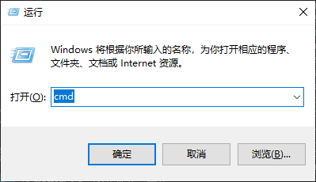
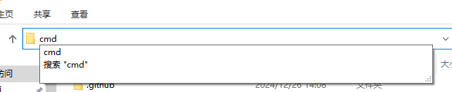
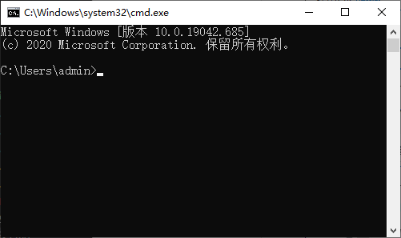

# Windows命令提示符

## 一、命令提示符是什么

    当下，人们在使用电脑时已经习惯于图形操作页面，只需要拖动鼠标选中即可对文件进行操作或执行程序。但是，图形界面只能满足个人日常的使用，在要求更高的场合，程序员仍然需要通过命令行来与计算机系统进行直接交互。

    而命令提示符（CMD）就是Windows系统中内置的命令行工具。

## 二、打开命令提示符

    在Windows系统中打开CMD有很多方法，这里介绍两种：

①按下组合键 win+R ，在弹出的运行窗口中输入“cmd” 即可打开CMD窗口；

②在目录路径栏输入“cmd” 并回车即可从此处打开CMD窗口。

## 三、命令行的指令

打开后的CMD窗口长这样：

### 1.基本操作

#### cd：切换到指定目录

 `cd ..` 回到上一级目录

`cd a` 切换到当前目录中的a目录中

`cd ..\b` 在a目录中，直接使用相对路径的方法切换到b目录中

`cd d:\b` 使用绝对路径的方法切换到b目录中

注意：cd不能直接切换盘符，假如你在D盘想切换到C盘下的目录，应该先使用 `C:`

#### echo：打印

`echo "字符串"` 打印内容到屏幕上

`echo abc>a.txt` 把abc字符串打印到文件a.txt中，>是重定向符号，abc会覆盖a.txt中原本的内容

`echo 456>>a.txt` 把456字符串追加到文件a.txt中，>>不会覆盖原内容

### 2.文件操作

#### dir：显示当前目录下的所有内容

`dir`

#### md：创建新的目录

`md aaa` 在当前目录下创建新的空目录aaa

`md d:\ddd\eee` 在D盘中创建多级目录ddd，在ddd中创建了eee

#### rd：删除目录

`rd aaa` 删除当前目录下的aaa（aaa必须是空目录）

`rd /s fff` 删除当前目录下的fff（包括fff中所有的子目录与文件）

#### del：删除文件

`del a.txt` 删除当前目录下的a.txt

#### attrib：修改文件属性

`attrib +h +r a.txt` 给文件增加只读、隐藏属性

#### type：查看文件

`type a.txt` 查看文件a.txt

#### copy：复制

`copy b.txt bbb` 把当前目录下的b.txt复制到目录bbb中

#### move：移动

`move b.txt bbb` 把当前目录下的b.txt移动到目录bbb中

#### ren：重命名

`ren a.txt b.txt` 把a.txt重命名为b.txt

### 3.网络

#### ipconfig：查看本机ip

#### ping：测试网络联通性

`ping www.baidu.com` 测试本机与百度网站之间的联通性
