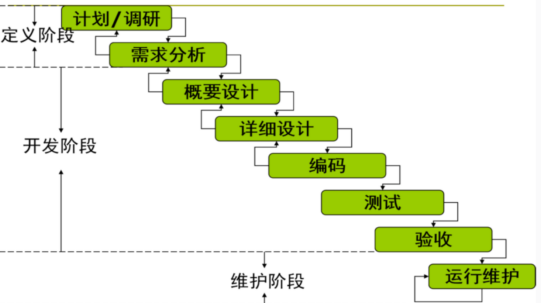
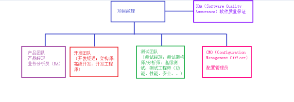

# 软件测试概论

## 一、关于软件测试概论

### 1.测试概论的内容

这是一门有关于软件测试的理论课程。

主要有2个要点：

1. 软件开发的生命周期
2. 软件测试的流程

### 2.学习本课程的作用

可以从专业角度理解软件测试，并对未来的工作内容有所了解。

### 3.软件测试的概念

#### (1) 软件是什么

软件是计算机中与硬件相结合的一部分，包括程序和文档。可以简单的表示如下：

软件=程序（program）+文档（document）

#### (2) 软件测试是什么

早期定义：

软件测试（Software Testing）就是为了发现错误而执行程序或系统的过程。

 **标准定义** ：

官方（IEEE：美国电子电气工程师协会）的定义

使用**人工****或****自动**的手段来**运行或测试**某个系统的 **过程** ，其目的在于检验被测试系统是否**满足规定的需求**或是弄清预期结果与实际结果之间的 **差别** 。

注：规定的需求来自于需求文档；“预期结果”来自于需求文档，“实际结果”来自于软件系统实际的表现。

#### (3) 软件测试的目的

1. **证明**软件可以工作
2. **检测**出软件的缺陷
3. **预防**软件的缺陷，提高软件质量

## 二、软件开发的生命周期

软件测试是软件开发生命周期里的重要环节/不可或缺的一部分，它与整个软件开发生命周期的关系密切。在介绍软件测试相关知识之前，我们有必要首先来了解软件开发的生命周期。

软件开发的生命周期（Software Development Life Cycle， **SDLC** ）是指软件 **从构思到停止使用的整个过程** 。它包括一系列的阶段，这些阶段通常包括：计划/调研、需求分析、概要设计、详细设计、编码、测试、验收、运行维护。

上图为软件生命周期的各个阶段

### 2.1 软件生命周期的各个活动

#### 软件项目计划：

    角色：项目经理

    职责：分配项目任务；制定项目进度；识别项目风险；估算项目成本、确立项目目标

    产出：软件项目计划（SPP：Software Project Plan）

#### 需求分析：

    角色：产品经理

    职责：调研和从各种渠道获取需求（客户访谈；竞品分析；问卷调查；原型法；头脑风暴……）；分析需求

    产出：**软件需求规格说明书** （SRS：Software Requirement Specification）

#### 设计：

    角色：架构师

    职责：根据需求和计划的安排对整个软件系统的结构做设计（软件系统的架构设计B/S，C/S等；选用的工具和技术；功能模块的划分等）

    角色：高级开发工程师

    职责：根据需求和概要设计文档，将具体的函数/表如何实现做设计（模块算法的设计、模块间的交互设计、数据库的设计等）

    产出：概要设计说明书（HLD：High Level Design）、详细设计说明书（LLD：Low Level Design）

#### 编码实现：

    角色：开发工程师

    职责：根据详细设计文档完成代码的编写；数据库表的实现

    产出：代码；数据库的表

#### 测试（重要）

**
    角色：测试团队**

**
    职责：就是完成整个软件生命周期的各种测试工作；**

**
    产出：****各个阶段测试计划、方案、用例、脚本、缺陷报告、总结报告**

#### 验收：

    角色：用户、开发人员、测试人员

    职责：用户试用软件产品，验证该项目是否符合原始的预期，如果发现问题可以及时反馈给项目团队进行修正。

    产出：验收测试计划、用例、报告等

#### 运行和维护

    角色：运维人员

    职责：部署系统；做售后支持

    产出：运维手册

### 2.2 软件项目的各个角色

