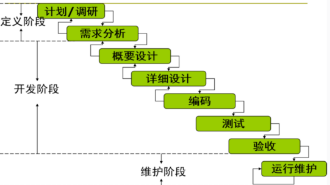
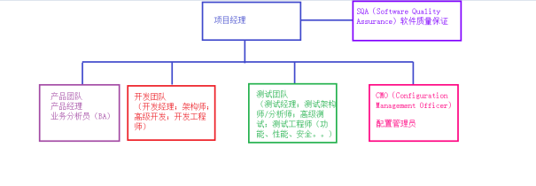

# 软件测试概论

## 一、关于软件测试概论

### 1.测试概论的内容

这是一门有关于软件测试的理论课程。

主要有2个要点：

1. 软件开发的生命周期
2. 软件测试的流程

### 2.学习本课程的作用

可以从专业角度理解软件测试，并对未来的工作内容有所了解。

### 3.软件测试的概念

#### (1) 软件是什么

软件是计算机中与硬件相结合的一部分，包括程序和文档。可以简单的表示如下：

软件=程序（program）+文档（document）

#### (2) 软件测试是什么

早期定义：

软件测试（Software Testing）就是为了发现错误而执行程序或系统的过程。

 **标准定义** ：

官方（IEEE：美国电子电气工程师协会）的定义

使用**人工****或****自动**的手段来**运行或测试**某个系统的 **过程** ，其目的在于检验被测试系统是否**满足规定的需求**或是弄清预期结果与实际结果之间的 **差别** 。

注：规定的需求来自于需求文档；“预期结果”来自于需求文档，“实际结果”来自于软件系统实际的表现。

#### (3) 软件测试的目的

1. **证明**软件可以工作
2. **检测**出软件的缺陷
3. **预防**软件的缺陷，提高软件质量

## 二、软件开发的生命周期

软件测试是软件开发生命周期里的重要环节/不可或缺的一部分，它与整个软件开发生命周期的关系密切。在介绍软件测试相关知识之前，我们有必要首先来了解软件开发的生命周期。

软件开发的生命周期（Software Development Life Cycle， **SDLC** ）是指软件 **从构思到停止使用的整个过程** 。它包括一系列的阶段，这些阶段通常包括：计划/调研、需求分析、概要设计、详细设计、编码、测试、验收、运行维护。

上图为软件生命周期的各个阶段

### 2.1 软件生命周期的各个活动

#### 软件项目计划：

角色：项目经理

职责：分配项目任务；制定项目进度；识别项目风险；估算项目成本、确立项目目标

产出：软件项目计划（SPP：Software Project Plan）

#### 需求分析：

角色：产品经理

职责：调研和从各种渠道获取需求（客户访谈；竞品分析；问卷调查；原型法；头脑风暴……）；分析需求

产出：**软件需求规格说明书** （SRS：Software Requirement Specification）

#### 设计：

角色：架构师

职责：根据需求和计划的安排对整个软件系统的结构做设计（软件系统的架构设计B/S，C/S等；选用的工具和技术；功能模块的划分等）

角色：高级开发工程师

职责：根据需求和概要设计文档，将具体的函数/表如何实现做设计（模块算法的设计、模块间的交互设计、数据库的设计等）

产出：概要设计说明书（HLD：High Level Design）、详细设计说明书（LLD：Low Level Design）

#### 编码实现：

角色：开发工程师

职责：根据详细设计文档完成代码的编写；数据库表的实现

产出：代码；数据库的表

#### 测试（重要）：

**角色：测试团队**

职责：就是完成整个软件生命周期的各种测试工作

产出：**各个阶段测试计划、方案、用例、脚本、缺陷报告、总结报告**

#### 验收：

角色：用户、开发人员、测试人员

职责：用户试用软件产品，验证该项目是否符合原始的预期，如果发现问题可以及时反馈给项目团队进行修正。

产出：验收测试计划、用例、报告等

#### 运行和维护

角色：运维人员

职责：部署系统；做售后支持

产出：运维手册

### 2.2 软件项目的各个角色

## 三、常见的开发模型

### 3.1 顺序模型

顺序型模型的特点是项目中每一个阶段都需要按照严格的顺序执行，上一个阶段没有完成不允许进入下一个阶段。顺序型的模型中最具代表性的有瀑布模型、V模型和双V模型。

#### 瀑布模型

瀑布模型将软件生命周期的各项活动规定为按固定顺序而连接的若干阶段工作，形如瀑布流水，最终得到软件产品。

它是软件工程早期最重要和最经典的一个模型，后期很多其它模型都是在它的基础上进行修改和完善。

#### V 模型

在 V模型 中将整个软件生命周期的步骤进行了明确的定义，并且将开发和测试的生命周期同时包含在一个模型中。测试的每一个阶段都针对于开发的某一个阶段，这样可以使每个开发阶段都进行针对性测试，可以大大提升软件的质量。

#### 双 V 模型

由于V模型没有从本质上改变瀑布模型的缺点，因此在1991年有人提出了一个新的模型，由于形状像两个V字型，因此叫做'双V模型'或者'W模型'。

双V模型的重大改变有两点，首先将测试工作分解成设计和执行两部分，每一部分可单独执行；其次，测试的介入时间提前，贯穿于整个软件生命周期，这样开发和测试的工作就可以并发执行，既保证了质量，又提高了工作效率。

### 3.2 迭代增量模型

#### 迅捷开发

顺序型模型都有一些共同的缺点，比如不够灵活、无法应对需求频繁更改的情况，而且项目文档过多导致工期过长。

敏捷开发并不是一个模型，而是一种思想，它引入了迭代的思想。既然整个项目的需求可能经常更改，甚至于不确定，需要边做边想，那么就没有必要将整个项目当成一个整体且一次性做到位，而是可以采用增量的方式，将整个项目拆成无数个迭代周期，每个周期只做一部分功能。

对于敏捷开发思想，在实际应用中产生了多种不同的实践方式，比较著名的有Scrum、 Kanban、XP、水晶方法等，目前应用比较多的是Scrum和Kanban方法。

#### 螺旋模型

对于一些可能存在很大风险的软件项目，有人在1988年提出了一个叫做'螺旋模型'的模型，这个模型是以瀑布模型为基础演化的强调风险管控的模型。

'螺旋模型'将一个项目拆分成多个迭代（螺旋），每个迭代（螺旋）分成四个阶段：

1. 制定计划：对要做的事情指定一个计划，包括做什么、需要哪些条件等；
2. 风险分析：指出项目过程中可能出现的风险，并提出应对的方案；
3. 实施工程：具体实现软件的设计、开发、测试等工作；
4. 客户评估：相当于产品的验收，客户体验产品并提出改进意见；

#### 快速原型

快速原型模型并不能算一个完全独立的模型，它更多应用在需求确认阶段，即使用一些工具做出一个高度仿真的界面，包括界面上的交互功能。这样可以最大程度上帮用户理清思路，尽快确定项目的细节，另外，也可以大大减少在项目后期用户推翻需求所带来的争端。

## 四、测试的种类

软件测试根据不同的维度可以分成不同的种类。这些方法之间不存在包含的从属关系，只是维度不同。

### 4.1 质量测试

##### 功能测试

功能测试主要验证软件中实现的功能有没有满足最终的用户需求。

由于在实际使用软件过程中，用户除了对软件的正常操作以外，还会进行很多异常的操作，比如执行'登录'功能，用户可以不输入用户名或密码直接点击登录按钮等。这些情况很可能导致软件触发不可预期的问题，而这种异常操作的场景远多于正常操作。

所以测试人员需要设计出尽可能多的异常操作的场景，确保在各种情况下软件不会出现异常。

##### 性能测试

性能测试主要验证软件在一定的压力下是否能够稳定、流畅地运行。比如大量用户同时访问某个网站，可能会导致网站响应变慢或者瘫痪。

##### 安全测试

安全测试主要验证软件是否存在一些安全隐患，从而导致系统被人为破坏、数据被窃取等情况的发生。

##### 兼容性测试

兼容性测试主要根据软件自身的特性和需求，验证软件在不同的环境下是否都能保持正常运行。

兼容性测试可能涉及很多不同要素的兼容性，比如硬件的兼容性、软件的兼容性、操作系统的兼容性、版本的兼容性等。

##### 易用性测试

易用性测试指的是验证用户在使用软件的时候是否感觉方便，以用户的角度出发，以良好的使用体验为最终目标。

##### 可维护性测试

软件上线以后还会进行多次更改，比如修复漏洞或者添加功能，这时就需要考虑软件是否容易被修复代码和增加新功能，就需要进行可维护性测试。

### 4.2 按阶段划分

根据软件生命周期的工作流程，可以将软件测试分成单元测试、集成测试、系统测试、验收测试几个阶段。

##### 单元测试

单元测试是指对软件中的最小可测试单元进行检查和验证。

在开发人员将代码写出来以后，还没有实际部署到测试环境中时，可以对代码中的某个函数进行测试。如果在开发阶段，针对每一个函数都进行验证，那么问题就可以在早期被发现和解决，就不会拖到测试阶段再来处理。

##### 集成测试

集成测试是指多个函数联合起来运行，验证功能的正确性。集成测试同样可以通过写代码来调用函数的方式进行，也可以将集成好的功能提供一个外部的接口供测试人员调用，测试人员通过工具调用接口来进行测试。

##### 系统测试

系统测试，是对整个系统的测试，是站在用户的角度，对软件中的某个功能进行测试，来验证软件是否达到功能、性能和安全性的要求。在做功能测试时，测试人员一般模拟普通用户对软件进行各种人工操作，而性能测试和安全测试可以借助一些自动化工具结合人工一起来执行。

##### 验收测试

在给所有用户正式使用前，可以挑选少量用户对软件进行一些测试，这种测试叫做验收测试。

用户验收测试可以分成两种，一种叫做 **Alpha测试** ' ，是指受控环境下的验收测试，即让用户在测试环境下进行功能的验证，出现问题可以及时修复；另一种叫做  **beta测试** ，是让用户在线上的真实环境下进行测试，这种测试反映的问题更真实可信。

### 4.3 按透明度划分

#### 黑盒测试

黑盒测试指的是将整个软件看成是一个不透明的盒子，通过该软件提供的访问方式（界面或接口）对软件进行功能的测试，而不用关注这个软件是怎么实现的（不需要看代码和数据库）。

#### 白盒测试

白盒测试和黑盒测试相反，是将被测软件当成一个透明的盒子，里面的所有东西都清晰可见，是针对软件源代码进行测试的一种手段。

针对代码的测试可以通过两种方式。第一种方式叫做'静态测试' ，即不运行代码，直接用肉眼查看代码，观察代码中是否存在诸如书写不规范、隐藏性能、安全问题等；第二种方式叫做'动态测试' ，即写一些测试代码，通过运行测试来调用被测的代码，观察其正确性。

白盒测试不仅限于源代码，也包括数据库的测试，包括数据库的表结构是否正确，运行过程中数据的变化是否正确等，总之一切软件的实现过程对于测试人员都是可见、可测的。

### 4.4 按状态划分

#### 静态测试

静态测试是指不运行代码的情况下进行测试。

静态测试的对象不仅限于项目源代码，而包含所有项目的产出物及过程文档，比如对需求文档、测试用例的审查，对数据库表结构的检查等。

静态测试可以通过人工检查的方法，即肉眼观察被测对象，也可以通过工具进行，比如有一些扫描工具可以自动扫描源代码，并输出测试报告，列举代码中可能存在的问题。

对于一些不可运行的被测对象，如需求文档等，只能使用静态测试方法进行测试，而对于代码等可运行对象来说，静态测试可以作为动态测试的补充，可以发现动态测试中不容易发现的一些问题。

#### 动态测试

动态测试就是指在代码运行状态下进行测试。

动态测试是软件测试过程中的主要手段，大部分时间测试人员都是在软件运行状态下进行测试，动态测试的好处是可以直观看到软件执行的结果，另外可以通过在运行过程中输出的动态日志来帮助定位问题。

### 4.5 按手段划分

#### 人工测试

人工测试指测试人员在测试过程中完全依赖于人工进行验证，比如功能测试中，测试人员模拟用户使用鼠标、键盘对界面进行各种操作来验证结果。即使有一些不带界面的功能，需要使用特定工具进行测试，也需要人工对工具进行操作，一边操作一边观察结果。

因此人工测试的标志是，测试整个过程需要由人工来一步步执行，结果的验证也需要人工来比较实际结果和预期结果是否一致。

对于一个新项目来说，几乎所有功能测试都需要通过人工测试来完成，因此人工测试是大部分测试人员的主要工作。

#### 自动化测试

自动化测试是指使用一些特定工具，预先在工具中编写一些自动化的脚本或代码，并设定预期结果，通过运行这些自动化脚本或代码，来进行全程无人值守的测试。

自动化测试可以应用于各种类型的测试，比如功能测试、性能测试、安全测试等。对于功能测试来说，有一些重要的功能，在每个项目版本发布的时候都需要测试一遍，这时就可以使用自动化测试手段，来减少人工测试的重复工作量。对于性能测试和安全测试来说，有些测试场景用人工测试无法实现，比如模拟一万个人同时访问网站，这时就需要使用自动化测试工具来生成自动化脚本，通过执行自动化脚本来进行测试。

### 4.6 其它测试方法

#### 冒烟测试

指对整个项目进行功能测试时，先不进行非常细致的测试，而是对每一个已经实现的功能做一个粗略的测试，目的是检验开发人员提交的这个功能是否能够真正地运行起来。

冒烟测试可以作为测试人员进行系统测试的输入标准，避免了测试人员对一个功能点反复测试带来的工作量，规范了开发人员的自检操作。

#### 回归测试

回归测试是指对已经测试过的功能点再次进行测试，是测试人员最常用的一种测试手段。

开发人员修复某个缺陷时，需要由测试人员再次验证这个问题是否确实被修复，亦或者可能由于改动一个地方的代码而影响到了另一个地方的代码，导致原来没有问题的功能点出现了问题。

#### 自由测试

也称为探索性测试，测试人员在没有严格定义的测试脚本的情况下对软件进行测试。这种方法依赖于测试人员的直觉和创造力，他们可以自由地探索软件的功能和性能，以发现潜在的问题或错误。

#### 交叉测试

交叉测试通常是指由不同的测试团队或个人对软件进行测试，以确保测试的全面性和客观性。

## 五、软件测试的流程

软件测试流程中有四个步骤：

#### 1. 制定测试计划

角色：测试经理/测试组长

职责：确定测试工作范围；分配测试工作任务；制定测试进度；确定测试目标；识别测试风险；估算测试工作量

产出：系统测试计划、集成测试计划、单元测试计划

#### 2. 设计测试方案

角色：测试分析设计师/测试架构师/高级测试工程师

职责：根据人员配置与时间成本，编写对应的测试方案，以及提供技术指导

产出：系统测试方案、集成测试方案、单元测试方案

#### 3. 实现测试方案

角色：测试工程师

职责：根据方案编写测试用例与测试脚本

产出：测试用例、脚本、规程

#### 4. 执行测试方案

角色：测试工程师

职责：根据计划部署测试环境、准备测试数据、按照规程执行测试用例和脚本，记录测试用例的执行结果

产出：测试缺陷报告、日报、总结报告

## 六、测试用例

测试用例的写作是测试人员的基本功

### 6.1 什么是测试用例

测试用例是测试工程师进行执行工作的指导性文件。用来指导参与测试执行的工作人员如何去测试一个具体的案例与情况。

### 6.2 测试用例的格式

编写用例的时候都需要遵循一定的格式，填写一些必要的信息。

这里介绍测试用例的通用8大要素：

#### 测试用例编号

用于识别测试用例

要求：从大---小

系统测试（SRS）：产品（项目）名称-测试阶段（ST）-系统测试项-系统测试子项-序列号

集成测试（HLD）：产品（项目）名称-测试阶段（IT）-集成测试项-集成测试子项-序列号

单元测试（LLD）：产品（项目）名称-测试阶段UT）-单元测试项-单元测试子项-序列号

示范：wechat-st-func-login-01

#### 测试项

用于分类

要求：可以用一个名称作为测试项名，这个名称能代表一组共同特点的测试用例

示范：微信登录功能

#### 标题

用于体现测试用例的特点和唯一目的

要求：尽量唯一，不能和其他用例混淆

示范：用户名与密码正确时登录测试

#### 优先级（重要级别）

用于区分轻重缓急，一般分为：

高级：重要的特性（功能）；基本功能；核心业务；使用频率高的用例

中级：次要的特性；备选业务；使用频率中等的用例

一般：不太关注的特性；不太常用的业务

#### 预置条件

有些用例需要提前准备一些该用例专有的环境或者数据

#### 输入

用于说明测试执行操作的具体信息

要求：信息要具体精确，保证不同的执行人看到数据的描述得到的理解是一致的

#### 操作步骤

用于指导测试人员具体的动作与操作

要求：翔实确定，精确到每一个步骤

#### 预期结果

用于判断测试的结果是否正确

要求：描述要具体明确

以下是一个写好的测试用例示范：

## 七、缺陷报告

### 7.1 什么是缺陷

与预期不一致的结果，即软件出现了bug

测试人员需要将发现的缺陷按一定的格式提交书面文档，即缺陷报告

### 7.2 缺陷报告的格式

与测试用例格式类似，缺陷报告包含如下要素：

缺陷编号、缺陷标题严重程度、缺陷提交人、缺陷提交时间、优先级别、能否重现/重现度、详细描述（重现步骤）、测试版本、测试环境、测试类型、对应需求/测试用例编号、状态、指派人、测试阶段、附件

### 7.3 跟踪并管理缺陷

