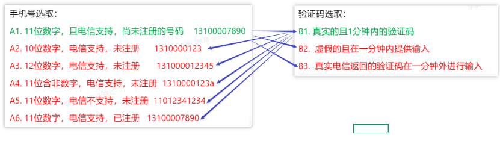
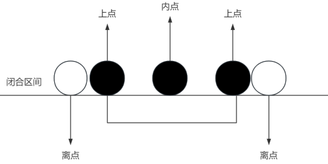
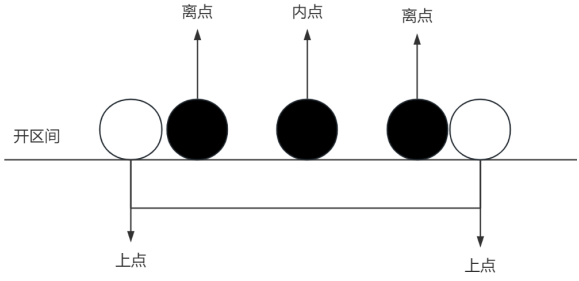
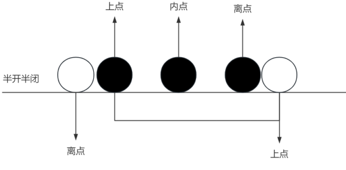

# 测试用例的设计方法

之前在软件测试概论中学习了编写测试用例的格式，但是在实际工作过程中，并不是完全靠测试人员的天马行空来编写测试用例的。

至少，我们有一套基本的理论来指导如何设计测试用例，本节课是完全的理论课，介绍了多种设计测试用例的方法。

## 一、前言

### 什么是测试用例设计

指为了确保软件或系统的功能、性能、兼容性等方面符合预期而设计的一系列测试用例的方法

## 二、等价类分析法

### 1. 定义

对于程序的某一输入域，存在若干输入可能，如果一组输入数据会导致程序表现出相同行为，可以视作一个【等价类】

从数据的合理性和非法性的角度来讲，等价类又可以划分为有效等价类与无效等价类。

有效等价类：

* 符合需求说明书的要求，应该被程序正常处理的输入数据

无效等价类：

* 违背需求说明书的要求，程序应该拒绝处理或给出错误提示的输入数据
* 这些数据主要用于测试程序的健壮性和异常处理能力。

### 2. 步骤

1. 根据程序对输入数据的要求，判断**合理数据**与**非法数据**
2. 用合理数据划分出若干【有效等价类】，用非法数据划分出若干【无效等价类】
3. 从每个等价类中选取一个**有代表性的数据**参与测试
4. 组合等价类进行测试：
   1. 多个输入域的有效等价类组合
   2. 单个输入域的无效等价类与其他输入域的有效等价类组合

### 3. 实例

某站要求用户使用【手机号+短信验证码】进行注册，手机号 11 位数字，不允许重复注册，短信验证码 1 分钟内有效，请分析相关的测试数据。

手机号角度分析等价类：

| 分析角度     | 合法等价类 | 非法等价类 |
| ------------ | ---------- | ---------- |
| 手机号长度   | 11         | <11 或 >11 |
| 字符         | 数字       | 非数字     |
| 手机号真实性 | 合法号码   | 非号码     |
| 是否已注册   | 未注册     | 已注册     |

可得以下测试用手机号选取：

A1. 11 位数字，且电信支持，尚未注册的号码 13100007890

A2. 10 位数字，电信支持，未注册 1310000123

A3. 12 位数字，电信支持，未注册 131000012345

A4. 11 位含非数字，电信支持，未注册 1310000123a

A5. 11 位数字，电信不支持，未注册 11012341234

A6. 11 位数字，电信支持，已注册 13100007890

验证码角度分析等价类：

| 分析角度   | 合法等价类 | 非法等价类 |
| ---------- | ---------- | ---------- |
| 真伪验证码 | 真实验证码 | 错误验证码 |
| 超时验证码 | 1分钟以内  | 1分钟以外  |

可得以下测试用验证码选取：

B1. 真实的且 1 分钟内的验证码

B2. 虚假的且在一分钟内提供输入

B3. 真实电信返回的验证码在一分钟外进行输入

将手机号和验证码结合在一起，可以构成完整的测试用例：

书写测试用例：

| 用例ID | 用例标题             | 优先级 | 操作步骤                                                                  | 期望结果                     |
| ------ | -------------------- | ------ | ------------------------------------------------------------------------- | ---------------------------- |
| 1      | test_reg_valid_001   | H      | 1.输入未注册的11位有效号码 2.输入1分钟内的有效验证码 3.点击注册 | 注册成功                     |
| 2      | test_reg_inValid_001 | M      | 1.输入未注册的11位有效号码 2.输入1分钟以外的超时验证码 点击注册 | 提示验证码超时 注册失败 |
| ...    |                      |        |                                                                           |                              |

在进行等价类覆盖时，输入域的有效等价类要尽可能在一个用例中进行覆盖；
而对无效等价类来讲，要尽可能的单独覆盖

## 三、边界值分析法

### 1. 定义

程序在处理数据时，在数据范围的边界处更容易出现错误，以边界为重心设计用例称之为边界值分析法。

边界值分析法涉及的边界点：

* 上点：边界上的点。这些点是必须测试的关键边界值
* 离点：边界范围外，距离边界点最近的一个点
* 内点：边界范围内的点

注意：闭区间的离点设置在区间外离边界点最近的一个点，而在开区间则是区间内离边界点最近的一个点：

### 2. 步骤

1. 对输入域进行等价类的划分
2. 根据等价类之间的边界，寻找边界点，即上点，离点
3. 编写测试用例

### 3. 实例

新生儿注册收费标准：
凡是在出生 42 天内到移民局进行注册的，免注册费；
凡是在出生超过 42 天而又在一年之内到移民局注册的，收取注册费 25$ ；
凡是在出生超过 1 年才到移民局注册的，收取注册费 100$。

注意：需求不明确时，不要盲目编写用例，一定先和产品经理确认需求，如上例中的第 42 天是否收费，一年是按照什么规则计算，如果按照天数，是否区分平年，闰年？

假设确定结果为：

* 免费：【0，42】
* 25$: 平年【43，365】,闰年【43，366】
* 100$: 平年【366，】，闰年【367，】

可以以此选取边界值：

注册免费：【0，42】 -1 0， 42， 43 （-1 可以用来检测系统输入的出生日期能否是明天）

25$: 平年：【43，365】 42，43， 365，366

25$: 闰年：【43，366】 42，43，366，367

100$: 平年【366，） 366，365

100$: 闰年【367，）367，366

**整合后的测试天数边界：**

任意年份：-1 ， 0 ，42， 43

平年： 365，366

闰年：366，367

**以此编写测试用例：**

| 用例ID | 用例标题             | 优先级 | 操作步骤          | 期望结果 |
| ------ | -------------------- | ------ | ----------------- | -------- |
| 1      | test_reg_valid_001   | H      | 出生当天注册      | 免费     |
| 2      | test_reg_valid_002   | H      | 出生42天注册      | 免费     |
| 3      | test_reg_valid_003   | H      | 出生43天注册      | 25$      |
| 4      | test_reg_valid_004   | H      | 出生365天注册     | 25$      |
| 5      | test_reg_valid_005   | H      | 平年出生366天注册 | 100$     |
| 6      | test_reg_valid_006   | H      | 闰年出生366天注册 | 25$      |
| 7      | test_reg_valid_007   | H      | 闰年出生367天注册 | 100$     |
| 8      | test_reg_invalid_001 | M      | 出生日期设为明天  | 不能注册 |

## 四、判定表分析法

### 1. 定义

采用二维表格的方式来考虑多个输入条件取值的排列组合，并基于每种组合分析程序的输出行为的方法。

### 2. 步骤

1. 分析输入条件及每个条件对应的取值
2. 分析程序的输出结果
3. 将多个输入条件的取值进行排列组合，用二维表格进行梳理
4. 对应每组输入组合，对应填写输出结果

### 3. 实例

某在线购物网站优惠券使用规则

**优惠券类型：**

满减券: 订单金额大于等于优惠券的最低使用金额时，减免固定金额

折扣券: 订单金额按一定比例打折。无最低使用金额限制

其他限制：每个订单只能使用一张优惠券

部分商品不参与优惠

**分析输入条件：**

商品是否参与优惠？参与，不参与

优惠券类型是什么？满减券，折扣券

订单金额是否满足满减券的最低使用金额？ 满足，不满足

**分析输出结果：**

是否优惠？满减，折扣，原价

**可以以此写出判定表：**

|              | 1    | 2      | 3    | 4      | 5      | 6      | 7      | 8      |
| ------------ | ---- | ------ | ---- | ------ | ------ | ------ | ------ | ------ |
| 是否参与优惠 | 参加 | 不参加 | 参加 | 不参加 | 参加   | 不参加 | 参加   | 不参加 |
| 优惠券类型   | 满减 | 满减   | 折扣 | 折扣   | 满减   | 满减   | 折扣   | 折扣   |
| 是否满足满减 | 满足 | 满足   | 满足 | 满足   | 不满足 | 不满足 | 不满足 | 不满足 |
|              |      |        |      |        |        |        |        |        |
| 结果         | 满减 | 原价   | 折扣 | 原价   | 原价   | 原价   | 折扣   | 原价   |

## 五、正交分析法

### 1. 定义

## 六、状态转换法
