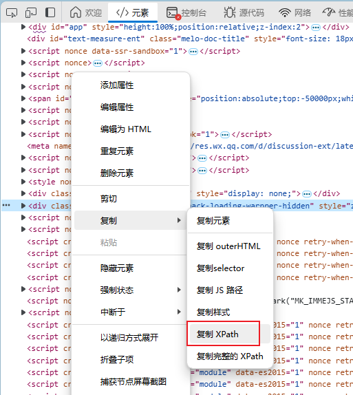

# Selenium WebDriver

Selenium 是为Web应用而开发的UI自动化测试工具，支持多系统，多浏览器，多语言。

Selenium WebDriver 是selenium的核心组件，提供了一套控制浏览器的方法，实现对浏览器的控制操作。

我们可以使用Selenium WebDriver定位网页中的元素，并模拟用户的操作，以进行UI自动化测试。

## 一、启动WebDriver

首先需要实例化一个浏览器驱动对象，如果相应的的浏览器exe文件不在环境变量中，可以通过 `executable_path` 来指定路径：

```python
from selenium import webdriver

#实例化浏览器驱动对象
driver = webdriver.Edge(executable_path='/path/driver.exe')

#常见的浏览器驱动：
webdriver.Firefox()
webdriver.Edge()
webdriver.Chrome()
webdriver.Safari()
```

在实例化对象后，会自动打开一个浏览器窗口，不过此刻它是空白的，可以通过 `driver.get()` 指定启动时进入的网页：

```python
from selenium import webdriver

#实例化浏览器驱动对象
driver = webdriver.Edge(executable_path='/path/driver.exe')

#指定启动进入的网站
driver.get('https://www.bing.com')
```

浏览器对象的基本操作方法：

```python
.get(url)			#访问指定页面
.maxmize_window()   		#窗口最大化
.minimize_window() 		#窗口最小化
.forward()			#页面前进
.refresh()			#刷新
.close()			#关闭当前页面
.quit()				#关闭整个浏览器
```

## 二、定位网页元素

想要操作网页元素，我们需要先定位它。

### 1. 定位方法

#### ①基础定位方法

`selenium.webdriver.common.by` 中定义了八种定位web页面元素的依据：

```python
class By(object):
    ID = "id"
    XPATH = "xpath"
    LINK_TEXT = "link text"
    PARTIAL_LINK_TEXT = "partial link text"
    NAME = "name"
    TAG_NAME = "tag name"
    CLASS_NAME = "class name"
    CSS_SELECTOR = "css selector"
```

| 说明             | 方法                                    |
| ---------------- | --------------------------------------- |
| 根据ID定位       | find_element(By.ID,'值')                |
| 根据Name定位     | find_element(By.Name,'值')              |
| 根据class定位    | find_element(By.CLASS_NAME,'值')        |
| 根据链接全文定位 | find_element(By.LINK_TEXT,'值')         |
| 根据部分文本定位 | find_element(By.PARTIAL_LINK_TEXT,'值') |
| 根据css样式定位  | find_element(By.CSS_SELECTOR,'值')      |
| 根据路径定位     | find_element(By.Xpath,'值')             |
| 根据类型定位     | find_element(By.TAG_NAME,'值')          |

方法调用格式：

```python
# dr是已经创建好的驱动对象
dr.find_element(By.ID,"ID值")
dr.find_element(By.Name,"Name值")
dr.find_element(By.CLASS_NAME,"class值")
dr.find_element(By.LINK_TEXT,"链接全文本")
dr.find_element(By.PARTIAL_LINK_TEXT,"链接部分文本")
dr.find_element(By.CSS_SELECTOR,"css信息")
dr.find_element(By.Xpath,"元素路径")
dr.find_element(By.TAG_NAME,"标签类型")

'''
注：find_element() 和 find_elements() 用法一致
find_element()  找到页面元素返回元素对象，找不到返回None值
find_elements() 找到页面元素返回元素对象列表，找不到返回空列表
'''
```

#### ②CSS补充定位

```python
# #value 表示id属性值
dr.find_element(By.CSS_SELECTOR,'#kw').send_keys('book')
# .value 表示class属性值
dr.find_element(By.CSS_SELECTOR,'.s_ipt').send_keys('book')
# [属性名='属性值']
dr.find_element(By.CSS_SELECTOR,'[class="s_ipt"]').send_keys('book')

# 可以多个属性复合定位
dr.find_element(By.CSS_SELECTOR,'[class="s_ipt"][name="wd"]').send_keys('book')
```

#### ③xPath路径定位

xpath路径表达式形式如下：

`/html/body/div/div[2]/div[5]/div[1]/div/form/span[1]/input`

`//form/span[1]/input`

`//*[@id="kw"]`

关于表达式：

| 表达式         | 描述                                         |
| -------------- | -------------------------------------------- |
| `<nodename>` | 选取此节点所有子节点                         |
| /              | 从根节点开始选取，绝对定位                   |
| //             | 从符合条件的元素开始，而不考虑位置，相对定位 |
| @              | 选取属性                                     |
| /body/div[2]   | 选择作为body元素的子元素的第二个div元素      |

可以通过在浏览器的开发者工具中获取选中元素的xpath路径：



### 2. IFrame元素选择

webdriver默认在最外层的网页内进行元素识别，网页嵌套的情况下，需要切换frame

```python
# 定位内部的html页面框架元素
iframe=dr.find_element(By.TAG_NAME,'iframe')

#切换到指定的Iframe
switch_to.frame(iframe)

#切换到上一级Iframe
switch_to.parent_frame()

#回到默认的Iframe，即最外层的网页
switch_to.default_content()
```

## 三、与元素交互

### 1. 元素对象基础操作

定位好元素后，即可对元素进行交互操作：

```python
.click()		#点击元素
.send_keys()		#键盘输入
.clear()		#文本清除
.get_attribute(属性名)	#获取元素属性
.check()		#勾选复选框、单选框等
.getText()		#获取元素文本内容
.getTagName()		#获取元素标签名
.isDisplayed()		#检查元素是否可见
.isEnabled()		#检查元素是否启用
```


### 2. 下拉框选择

对下拉框的操作，可导入Select类，利用其实现的方法操作：

```python
Select(select标签).select_by_index()		#根据下拉选项的下标值进行选择 

Select(select标签).select_by_value()		#根据下拉选项的value属性值进行选择 

Select(select标签).select_by_visible_text()	#根据下拉选项的文本进行选择 

Select(select标签).options()			#获取下拉选项的个数 
```

```python
from selenium import webdriver
from selenium.webdriver.common.by import By
from selenium.webdriver.support.select import Select

#创建浏览器对象
dr=webdriver.Firefox()
#打开网页   
dr.get('http://localhost/sourcePage/s1/singleselect.html')   

#使用ID定位页面的下拉列表元素
s=dr.find_element(By.ID,'education')

#实例化Select类对象
select=Select(s)
#根据下拉选项的下标值进行选择，下标值从0开始
select.select_by_index(1)
#根据下拉选项的可视文本进行选择
select.select_by_visible_text("博士")
#根据下拉选项的value进行选择
select.select_by_value("3")

#从上到下依次点击下拉选项
for i in select.options:   
    i.click()

```

### 3. 模拟鼠标键盘行为

可以使用webdriver的ActionChains 动作链模拟鼠标的操作，行为事件存储在actionchains对象队列，当使用perform()，事件按顺序执行

一般样式：

ActionChains(浏览器驱动对象).鼠标事件1(页面元素1).鼠标事件2(页面元素2)....鼠标事件n(页面元素n).perform()

用法：

```python
ActionChains(dr).move_to_element(element).perform()	#悬停 

ActionChains(dr).double_click(element).perform()	#双击 

ActionChains(dr).context_click(element).perform()	#右击 
```
